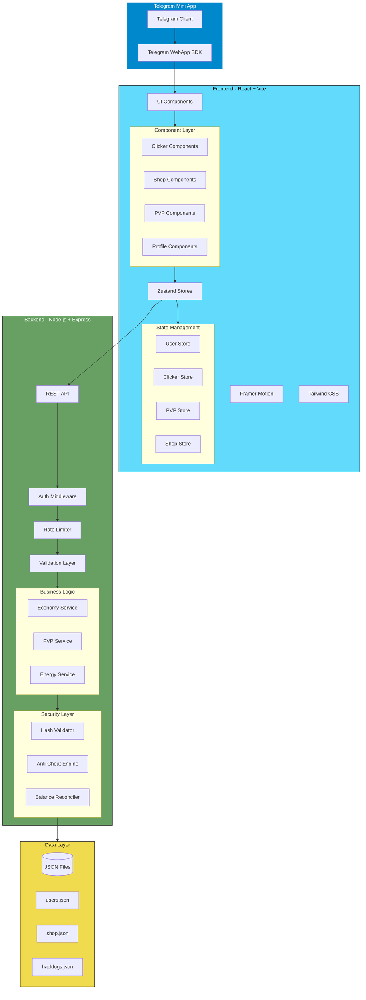
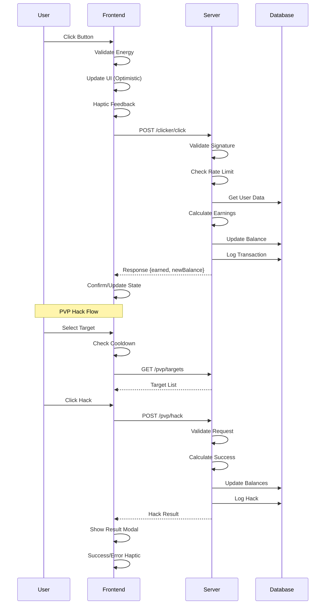

# The Glitch Hacker - Technical Architecture & Design Specification

## Table of Contents
1. [Project Overview](#1-project-overview)
2. [Project Structure](#2-project-structure)
3. [Data Models & Schema](#3-data-models--schema)
4. [API Endpoints](#4-api-endpoints)
5. [State Management](#5-state-management)
6. [Game Mechanics Logic](#6-game-mechanics-logic)
7. [Security Considerations](#7-security-considerations)
8. [Telegram Integration](#8-telegram-integration)
9. [Component Architecture](#9-component-architecture)
10. [System Architecture Diagram](#10-system-architecture-diagram)

---

## 1. Project Overview

### 1.1 Game Concept
The Glitch Hacker is a cyberpunk-themed idle-clicker Telegram Mini App where players:
- Click to mine $BITZ cryptocurrency
- Purchase auto-clicker upgrades (Botnets) for passive income
- Upgrade Firewall defense to protect against attacks
- PVP hack other players to steal their $BITZ

### 1.2 Tech Stack
| Layer | Technology |
|-------|------------|
| Frontend | React 18 + Vite + TypeScript |
| Styling | Tailwind CSS + Custom Cyberpunk Theme |
| Animations | Framer Motion |
| State Management | Zustand |
| Backend | Node.js + Express |
| Database | File-based JSON (LowDB) |
| Integration | Telegram Mini App SDK |

### 1.3 Core Game Loop
```
User Clicks → Earn $BITZ → Buy Botnets → Passive Income
     ↓
Upgrade Firewall → Defend Against Hacks ← PVP Hack Others
```

---

## 2. Project Structure

### 2.1 Root Directory Layout
```
tg/
├── docs/                          # Documentation
│   ├── ARCHITECTURE.md           # This document
│   └── API.md                    # API reference (generated)
├── frontend/                      # React + Vite Frontend
│   ├── public/
│   │   ├── manifest.json         # Telegram Mini App manifest
│   │   └── assets/
│   │       ├── images/           # Game images, icons
│   │       └── sounds/           # SFX, background music
│   ├── src/
│   │   ├── components/           # React components
│   │   │   ├── ui/              # Reusable UI components
│   │   │   ├── game/            # Game-specific components
│   │   │   └── layout/          # Layout components
│   │   ├── hooks/               # Custom React hooks
│   │   ├── stores/              # Zustand stores
│   │   ├── services/            # API services
│   │   ├── utils/               # Utility functions
│   │   ├── types/               # TypeScript types
│   │   ├── constants/           # Game constants
│   │   ├── styles/              # Global styles, Tailwind config
│   │   ├── App.tsx
│   │   └── main.tsx
│   ├── index.html
│   ├── package.json
│   ├── tailwind.config.js
│   ├── tsconfig.json
│   └── vite.config.ts
├── backend/                       # Node.js + Express Backend
│   ├── src/
│   │   ├── controllers/          # Route controllers
│   │   ├── middleware/           # Express middleware
│   │   ├── models/               # Data models
│   │   ├── routes/               # API routes
│   │   ├── services/             # Business logic
│   │   ├── utils/                # Utility functions
│   │   ├── validators/           # Input validators
│   │   ├── constants/            # Server constants
│   │   └── app.ts                # Express app entry
│   ├── data/                     # JSON database files
│   │   ├── users.json
│   │   ├── shop.json
│   │   └── hacklogs.json
│   ├── package.json
│   └── tsconfig.json
├── shared/                        # Shared types/constants
│   └── types/
│       └── index.ts
└── package.json                   # Root package.json (workspaces)
```

### 2.2 Frontend Component Structure
```
frontend/src/components/
├── ui/                           # Atomic UI components
│   ├── Button.tsx
│   ├── Card.tsx
│   ├── ProgressBar.tsx
│   ├── Modal.tsx
│   ├── Badge.tsx
│   └── GlitchText.tsx           # Cyberpunk text effect
├── layout/                       # Layout components
│   ├── MainLayout.tsx
│   ├── Header.tsx
│   ├── Navigation.tsx
│   └── TabBar.tsx
├── game/                         # Game feature components
│   ├── Clicker/                 # Clicker feature
│   │   ├── ClickerButton.tsx
│   │   ├── StatsDisplay.tsx
│   │   └── EnergyBar.tsx
│   ├── Shop/                    # Shop feature
│   │   ├── ShopItem.tsx
│   │   ├── ShopList.tsx
│   │   └── UpgradeCard.tsx
│   ├── PVP/                     # PVP feature
│   │   ├── PlayerList.tsx
│   │   ├── HackButton.tsx
│   │   ├── HackResult.tsx
│   │   └── DefenseStatus.tsx
│   └── Profile/                 # Profile feature
│       ├── UserStats.tsx
│       ├── Inventory.tsx
│       └── Achievements.tsx
└── screens/                      # Main screen components
    ├── HomeScreen.tsx
    ├── ShopScreen.tsx
    ├── PVPScreen.tsx
    └── ProfileScreen.tsx
```

### 2.3 Backend Service Structure
```
backend/src/
├── controllers/
│   ├── auth.controller.ts       # Telegram auth
│   ├── user.controller.ts       # User operations
│   ├── clicker.controller.ts    # Click/mining
│   ├── shop.controller.ts       # Shop operations
│   ├── pvp.controller.ts        # PVP hacking
│   └── leaderboard.controller.ts
├── services/
│   ├── user.service.ts
│   ├── economy.service.ts       # Currency calculations
│   ├── pvp.service.ts           # Hack calculations
│   ├── energy.service.ts        # Energy refill logic
│   └── shop.service.ts
├── middleware/
│   ├── auth.middleware.ts       # Telegram validation
│   ├── rateLimiter.middleware.ts
│   └── validation.middleware.ts
├── models/
│   ├── User.model.ts
│   ├── ShopItem.model.ts
│   └── HackLog.model.ts
└── utils/
    ├── crypto.ts                # Hashing/encryption
    ├── validators.ts
    └── logger.ts
```

---

## 3. Data Models & Schema

### 3.1 User Model
```typescript
interface User {
  // Telegram Identity
  id: string;                    // Telegram user ID (primary key)
  username: string;              // Telegram username
  firstName: string;             // Telegram first name
  lastName?: string;             // Telegram last name
  photoUrl?: string;             // Telegram avatar URL
  
  // Core Economy
  bitz: number;                  // Current $BITZ balance
  totalEarned: number;           // Lifetime earnings
  totalSpent: number;            // Lifetime spending
  
  // Clicker Stats
  clickPower: number;            // $BITZ per click (base: 1)
  totalClicks: number;           // Lifetime clicks
  
  // Energy System
  energy: number;                // Current energy (0-1000)
  maxEnergy: number;             // Max energy (default: 1000)
  lastEnergyRefill: string;      // ISO timestamp
  
  // Botnets (Auto-clickers)
  botnets: {
    id: string;                  // Shop item ID
    level: number;               // Upgrade level
    quantity: number;            // Number owned
    lastCollection: string;      // Last passive income collection
  }[];
  
  // Defense System
  firewall: {
    level: number;               // Firewall level (1-100)
    virusStrength: number;       // Attack power (1-100)
    lastUpgrade: string;         // ISO timestamp
  };
  
  // PVP Stats
  pvp: {
    hacksAttempted: number;
    hacksSuccessful: number;
    hacksDefended: number;
    bitzStolen: number;
    bitzLost: number;
    lastHackAttempt: string;     // ISO timestamp (cooldown)
  };
  
  // Timestamps
  createdAt: string;
  updatedAt: string;
  lastActive: string;
}
```

### 3.2 Shop Item Model
```typescript
interface ShopItem {
  id: string;                    // Unique identifier
  type: 'botnet' | 'firewall' | 'virus' | 'click_power';
  
  // Display
  name: string;
  description: string;
  icon: string;                  // Icon identifier or URL
  tier: 'common' | 'rare' | 'epic' | 'legendary';
  
  // Pricing (exponential scaling)
  basePrice: number;
  priceMultiplier: number;       // 1.15 = 15% increase per purchase
  
  // Effects
  effects: {
    type: 'passive_income' | 'click_power' | 'firewall' | 'virus' | 'energy';
    value: number;               // Base effect value
    scaling: number;             // Per-level scaling
  }[];
  
  // Limits
  maxLevel?: number;             // Max upgrade level
  requires?: string[];           // Prerequisite item IDs
  
  // Metadata
  unlockedAt?: number;           // Total earned threshold to unlock
}
```

### 3.3 Hack Log Model
```typescript
interface HackLog {
  id: string;                    // UUID v4
  
  // Participants
  attackerId: string;            // Telegram user ID
  attackerUsername: string;
  defenderId: string;            // Telegram user ID
  defenderUsername: string;
  
  // Hack Details
  timestamp: string;             // ISO timestamp
  success: boolean;              // Whether hack succeeded
  
  // Combat Stats
  attackerVirus: number;         // Attacker's virus level
  defenderFirewall: number;      // Defender's firewall level
  
  // Outcome
  bitzStolen: number;            // Amount stolen (0 if failed)
  defenseTriggered: boolean;     // Whether defense reduced damage
  
  // Anti-cheat
  clientTimestamp: string;       // Client-reported timestamp
  serverTimestamp: string;       // Server-received timestamp
  requestHash: string;           // HMAC signature
  ipAddress: string;             // Hashed IP for rate limiting
}
```

### 3.4 JSON Database Schema

#### users.json
```json
{
  "users": [
    {
      "id": "123456789",
      "username": "cyberpunk_user",
      "firstName": "Neo",
      "bitz": 15000,
      "totalEarned": 50000,
      "energy": 850,
      "maxEnergy": 1000,
      "lastEnergyRefill": "2026-01-31T09:00:00Z",
      "botnets": [
        {
          "id": "botnet_v1",
          "level": 5,
          "quantity": 3,
          "lastCollection": "2026-01-31T08:30:00Z"
        }
      ],
      "firewall": {
        "level": 12,
        "virusStrength": 8,
        "lastUpgrade": "2026-01-30T15:20:00Z"
      },
      "pvp": {
        "hacksAttempted": 45,
        "hacksSuccessful": 28,
        "hacksDefended": 12,
        "bitzStolen": 5000,
        "bitzLost": 1200,
        "lastHackAttempt": "2026-01-31T08:00:00Z"
      },
      "createdAt": "2026-01-15T10:00:00Z",
      "updatedAt": "2026-01-31T09:00:00Z"
    }
  ]
}
```

#### shop.json (Static Configuration)
```json
{
  "items": [
    {
      "id": "botnet_v1",
      "type": "botnet",
      "name": "Basic Botnet",
      "description": "A simple botnet for passive income",
      "icon": "botnet_basic",
      "tier": "common",
      "basePrice": 100,
      "priceMultiplier": 1.15,
      "effects": [
        {
          "type": "passive_income",
          "value": 1,
          "scaling": 0.5
        }
      ],
      "maxLevel": 50
    },
    {
      "id": "firewall_upgrade",
      "type": "firewall",
      "name": "ICE Barrier",
      "description": "Intrusion Countermeasures Electronics",
      "icon": "firewall_ice",
      "tier": "rare",
      "basePrice": 500,
      "priceMultiplier": 1.2,
      "effects": [
        {
          "type": "firewall",
          "value": 1,
          "scaling": 1
        }
      ],
      "maxLevel": 100
    }
  ]
}
```

#### hacklogs.json
```json
{
  "logs": [
    {
      "id": "hack_001",
      "attackerId": "123456789",
      "attackerUsername": "cyberpunk_user",
      "defenderId": "987654321",
      "defenderUsername": "matrix_runner",
      "timestamp": "2026-01-31T09:00:00Z",
      "success": true,
      "attackerVirus": 15,
      "defenderFirewall": 10,
      "bitzStolen": 250,
      "defenseTriggered": false,
      "clientTimestamp": "2026-01-31T09:00:00Z",
      "serverTimestamp": "2026-01-31T09:00:02Z",
      "requestHash": "sha256_hmac_signature",
      "ipAddress": "hashed_ip_string"
    }
  ]
}
```

---

## 4. API Endpoints

### 4.1 Authentication
```
POST /api/auth/telegram
├── Description: Authenticate user via Telegram Mini App
├── Headers:
│   ├── X-Telegram-Init-Data: {telegram_init_data}
│   └── Content-Type: application/json
├── Body: { initData: string }
└── Response: { user: User, token: string }
```

### 4.2 User Operations
```
GET /api/user/me
├── Description: Get current user profile
├── Auth: Bearer Token
└── Response: { user: User }

GET /api/user/leaderboard
├── Description: Get top players
├── Query: { limit?: number, offset?: number }
└── Response: { users: User[], total: number }

GET /api/user/:id
├── Description: Get public user profile
├── Auth: Bearer Token
└── Response: { user: PublicUser }
```

### 4.3 Clicker Operations
```
POST /api/clicker/click
├── Description: Register a click
├── Auth: Bearer Token
├── Body: { 
│   ├── timestamp: string,      // Client timestamp
│   ├── energyCost: number,     // Energy spent (default: 1)
│   └── hash: string            // Client-generated hash
│ }
└── Response: { 
    ├── earned: number,         // $BITZ earned
    ├── newBalance: number,
    ├── energyRemaining: number,
    └── clickPower: number
  }

GET /api/clicker/collect
├── Description: Collect passive income from botnets
├── Auth: Bearer Token
└── Response: { 
    ├── collected: number,      // $BITZ collected
    ├── newBalance: number,
    └── nextCollection: string  // ISO timestamp
  }

GET /api/clicker/energy
├── Description: Get current energy status
├── Auth: Bearer Token
└── Response: { 
    ├── current: number,
    ├── max: number,
    ├── refillRate: number,     // per second
    └── nextRefill: string
  }
```

### 4.4 Shop Operations
```
GET /api/shop/items
├── Description: Get all shop items
├── Auth: Bearer Token
└── Response: { items: ShopItem[] }

POST /api/shop/buy
├── Description: Purchase/upgrade item
├── Auth: Bearer Token
├── Body: { 
│   ├── itemId: string,
│   └── quantity?: number       // Default: 1
│ }
└── Response: { 
    ├── success: boolean,
    ├── newBalance: number,
    ├── item: ShopItem,
    └── userItem: UserItem
  }

GET /api/shop/prices
├── Description: Get current prices (with multipliers)
├── Auth: Bearer Token
└── Response: { 
    ├── items: { 
    │   ├── itemId: string,
    │   ├── currentPrice: number,
    │   └── nextPrice: number
    │ }[]
  }
```

### 4.5 PVP Operations
```
GET /api/pvp/targets
├── Description: Get potential hack targets
├── Auth: Bearer Token
├── Query: { 
│   ├── minFirewall?: number,
│   ├── maxFirewall?: number,
│   └── limit?: number         // Default: 10
│ }
└── Response: { 
    ├── targets: PublicUser[],
    └── cooldownRemaining: number  // Seconds until next hack
  }

POST /api/pvp/hack
├── Description: Attempt to hack another player
├── Auth: Bearer Token
├── Rate Limit: 1 per 5 minutes per user
├── Body: { 
│   ├── targetId: string,       // Victim's Telegram ID
│   ├── timestamp: string,      // Client timestamp
│   ├── nonce: string,          // Random nonce for hash
│   └── hash: string            // HMAC(clientSecret + targetId + nonce)
│ }
└── Response: { 
    ├── success: boolean,
    ├── bitzStolen: number,
    ├── attackerBalance: number,
    ├── defenderFirewall: number,
    ├── attackerVirus: number,
    ├── cooldownEnds: string,   // ISO timestamp
    └── message: string
  }

GET /api/pvp/history
├── Description: Get hack history
├── Auth: Bearer Token
├── Query: { 
│   ├── type?: 'incoming' | 'outgoing' | 'all',
│   ├── limit?: number,
│   └── offset?: number
│ }
└── Response: { 
    ├── logs: HackLog[],
    └── total: number
  }

GET /api/pvp/stats
├── Description: Get PVP statistics
├── Auth: Bearer Token
└── Response: { 
    ├── hacksAttempted: number,
    ├── hacksSuccessful: number,
    ├── successRate: number,
    ├── bitzStolen: number,
    ├── bitzLost: number,
    └── netProfit: number
  }
```

### 4.6 Error Responses
```typescript
interface ApiError {
  status: number;
  code: string;
  message: string;
  details?: Record<string, any>;
}

// Common Error Codes
const ErrorCodes = {
  // 400 Bad Request
  INVALID_INPUT: 'INVALID_INPUT',
  INSUFFICIENT_FUNDS: 'INSUFFICIENT_FUNDS',
  INSUFFICIENT_ENERGY: 'INSUFFICIENT_ENERGY',
  MAX_LEVEL_REACHED: 'MAX_LEVEL_REACHED',
  
  // 401 Unauthorized
  INVALID_AUTH: 'INVALID_AUTH',
  TOKEN_EXPIRED: 'TOKEN_EXPIRED',
  
  // 403 Forbidden
  COOLDOWN_ACTIVE: 'COOLDOWN_ACTIVE',
  SELF_HACK: 'SELF_HACK',
  
  // 404 Not Found
  USER_NOT_FOUND: 'USER_NOT_FOUND',
  ITEM_NOT_FOUND: 'ITEM_NOT_FOUND',
  
  // 429 Too Many Requests
  RATE_LIMITED: 'RATE_LIMITED',
  CLICK_SPAM: 'CLICK_SPAM',
  
  // 500 Internal Server Error
  SERVER_ERROR: 'SERVER_ERROR'
};
```

---

## 5. State Management

### 5.1 Zustand Store Structure

#### useUserStore
```typescript
interface UserState {
  // User Data
  user: User | null;
  isLoading: boolean;
  error: string | null;
  
  // Actions
  setUser: (user: User) => void;
  updateBalance: (delta: number) => void;
  updateEnergy: (energy: number) => void;
  addBotnet: (botnet: UserBotnet) => void;
  upgradeFirewall: (level: number) => void;
  
  // Async Actions
  fetchUser: () => Promise<void>;
  syncWithServer: () => Promise<void>;
}

const useUserStore = create<UserState>((set, get) => ({
  user: null,
  isLoading: false,
  error: null,
  
  setUser: (user) => set({ user }),
  
  updateBalance: (delta) => set((state) => ({
    user: state.user ? {
      ...state.user,
      bitz: state.user.bitz + delta,
      totalEarned: delta > 0 ? state.user.totalEarned + delta : state.user.totalEarned
    } : null
  })),
  
  updateEnergy: (energy) => set((state) => ({
    user: state.user ? { ...state.user, energy } : null
  })),
  
  // ... other actions
}));
```

#### useClickerStore
```typescript
interface ClickerState {
  // Local Click State
  clickCount: number;
  totalClicks: number;
  clickPower: number;
  
  // Energy
  energy: number;
  maxEnergy: number;
  lastRefill: Date;
  
  // Passive Income
  passiveIncome: number;
  lastCollection: Date;
  uncollectedBitz: number;
  
  // Actions
  click: () => { earned: number; success: boolean };
  collectPassive: () => number;
  refillEnergy: () => void;
  calculatePassiveIncome: () => number;
}

const useClickerStore = create<ClickerState>((set, get) => ({
  // ... state and actions with energy refill calculation
}));
```

#### usePVPStore
```typescript
interface PVPState {
  // Targets
  targets: PublicUser[];
  targetsLoading: boolean;
  
  // Cooldown
  hackCooldown: number;          // Seconds remaining
  lastHackTime: Date | null;
  
  // History
  hackLogs: HackLog[];
  
  // Actions
  fetchTargets: () => Promise<void>;
  attemptHack: (targetId: string) => Promise<HackResult>;
  refreshCooldown: () => void;
}
```

#### useShopStore
```typescript
interface ShopState {
  items: ShopItem[];
  userItems: Map<string, UserItem>;
  prices: Map<string, number>;
  
  // Actions
  fetchItems: () => Promise<void>;
  buyItem: (itemId: string) => Promise<boolean>;
  getPrice: (itemId: string) => number;
  canAfford: (itemId: string) => boolean;
}
```

### 5.2 Store Persistence
```typescript
// Persist critical state to localStorage
const persistMiddleware = (config: any) => 
  persist(config, {
    name: 'glitch-hacker-storage',
    partialize: (state) => ({
      // Only persist non-sensitive data
      clickCount: state.clickCount,
      lastCollection: state.lastCollection,
    }),
  });
```

### 5.3 State Synchronization Strategy
```
┌─────────────────┐     ┌─────────────────┐     ┌─────────────────┐
│   Client State  │◄────│  Optimistic UI  │◄────│  Server State   │
│   (Zustand)     │     │  (Immediate)    │     │  (Source)       │
└─────────────────┘     └─────────────────┘     └─────────────────┘
         │                       │                       │
         │                       │                       │
    User Action ──► Update UI ──► API Call ──► Server Validation
         │                       │                       │
         │                       │                       │
    Rollback ◄── Error ◄────────┘               Success ──► Confirm
```

---

## 6. Game Mechanics Logic

### 6.1 Energy System

#### Energy Configuration
```typescript
const ENERGY_CONFIG = {
  MAX_ENERGY: 1000,
  REFILL_RATE: 10,              // Energy per second
  CLICK_COST: 1,                // Energy per click
  REFILL_INTERVAL: 1000,        // Milliseconds
};
```

#### Energy Refill Algorithm
```typescript
function calculateEnergyRefill(
  currentEnergy: number,
  lastRefillTime: Date,
  now: Date = new Date()
): number {
  const elapsedMs = now.getTime() - lastRefillTime.getTime();
  const elapsedSeconds = elapsedMs / 1000;
  
  const energyToAdd = Math.floor(elapsedSeconds * ENERGY_CONFIG.REFILL_RATE);
  const newEnergy = Math.min(
    currentEnergy + energyToAdd,
    ENERGY_CONFIG.MAX_ENERGY
  );
  
  return newEnergy;
}

// Pseudocode for Energy Manager
class EnergyManager {
  private energy: number = ENERGY_CONFIG.MAX_ENERGY;
  private lastRefill: Date = new Date();
  private refillTimer: IntervalId | null = null;
  
  startRefill() {
    this.refillTimer = setInterval(() => {
      this.energy = calculateEnergyRefill(this.energy, this.lastRefill);
      this.lastRefill = new Date();
      this.notifySubscribers();
    }, ENERGY_CONFIG.REFILL_INTERVAL);
  }
  
  canClick(): boolean {
    return this.energy >= ENERGY_CONFIG.CLICK_COST;
  }
  
  spendEnergy(amount: number = ENERGY_CONFIG.CLICK_COST): boolean {
    if (this.energy < amount) return false;
    this.energy -= amount;
    return true;
  }
}
```

### 6.2 Passive Income Calculation

#### Botnet Income Formula
```typescript
function calculatePassiveIncome(
  botnets: UserBotnet[],
  shopItems: ShopItem[],
  lastCollection: Date,
  now: Date = new Date()
): number {
  let totalIncome = 0;
  const elapsedHours = (now.getTime() - lastCollection.getTime()) / (1000 * 60 * 60);
  
  // Cap offline earnings at 4 hours
  const cappedHours = Math.min(elapsedHours, 4);
  
  for (const botnet of botnets) {
    const shopItem = shopItems.find(item => item.id === botnet.id);
    if (!shopItem) continue;
    
    const baseIncome = shopItem.effects.find(e => e.type === 'passive_income')?.value || 0;
    const scaling = shopItem.effects.find(e => e.type === 'passive_income')?.scaling || 0;
    
    // Income = (base + (level * scaling)) * quantity * hours
    const itemIncome = (baseIncome + (botnet.level * scaling)) * botnet.quantity * cappedHours;
    totalIncome += itemIncome;
  }
  
  return Math.floor(totalIncome);
}

// Pseudocode for Collection
async function collectPassiveIncome(): Promise<number> {
  const user = getCurrentUser();
  const now = new Date();
  
  const earned = calculatePassiveIncome(
    user.botnets,
    shopItems,
    new Date(user.botnets[0]?.lastCollection || user.createdAt),
    now
  );
  
  if (earned > 0) {
    await api.post('/clicker/collect', { timestamp: now.toISOString() });
    userStore.updateBalance(earned);
    
    // Update last collection time for all botnets
    for (const botnet of user.botnets) {
      botnet.lastCollection = now.toISOString();
    }
  }
  
  return earned;
}
```

### 6.3 PVP Hack Calculation

#### Hack Success Formula
```typescript
const PVP_CONFIG = {
  COOLDOWN_SECONDS: 300,        // 5 minutes between hacks
  BASE_SUCCESS_CHANCE: 0.5,     // 50% at equal levels
  LEVEL_ADVANTAGE: 0.05,        // 5% per level difference
  MAX_STEAL_PERCENTAGE: 0.1,    // Max 10% of victim's balance
  MIN_STEAL_AMOUNT: 10,         // Minimum steal amount
  DEFENSE_REDUCTION: 0.3,       // Defense reduces theft by 30%
};

function calculateHackSuccess(
  attackerVirus: number,
  defenderFirewall: number
): { success: boolean; chance: number } {
  const levelDiff = attackerVirus - defenderFirewall;
  const successChance = Math.max(
    0.1,                        // Minimum 10% chance
    Math.min(
      0.9,                      // Maximum 90% chance
      PVP_CONFIG.BASE_SUCCESS_CHANCE + (levelDiff * PVP_CONFIG.LEVEL_ADVANTAGE)
    )
  );
  
  const roll = Math.random();
  return {
    success: roll < successChance,
    chance: successChance
  };
}

function calculateStealAmount(
  victimBalance: number,
  success: boolean,
  defenseTriggered: boolean
): number {
  if (!success) return 0;
  
  const baseSteal = Math.max(
    PVP_CONFIG.MIN_STEAL_AMOUNT,
    victimBalance * PVP_CONFIG.MAX_STEAL_PERCENTAGE
  );
  
  if (defenseTriggered) {
    return Math.floor(baseSteal * (1 - PVP_CONFIG.DEFENSE_REDUCTION));
  }
  
  return Math.floor(baseSteal);
}

// Pseudocode for Hack Attempt
async function attemptHack(targetId: string): Promise<HackResult> {
  const user = getCurrentUser();
  
  // Check cooldown
  const lastHack = new Date(user.pvp.lastHackAttempt);
  const cooldownEnd = new Date(lastHack.getTime() + PVP_CONFIG.COOLDOWN_SECONDS * 1000);
  
  if (new Date() < cooldownEnd) {
    return { success: false, error: 'COOLDOWN_ACTIVE', cooldownRemaining: cooldownEnd };
  }
  
  // Fetch target data
  const target = await api.get(`/user/${targetId}`);
  
  // Calculate outcome
  const { success, chance } = calculateHackSuccess(
    user.firewall.virusStrength,
    target.firewall.level
  );
  
  const defenseTriggered = Math.random() < (target.firewall.level / 200);
  const bitzStolen = calculateStealAmount(target.bitz, success, defenseTriggered);
  
  // Execute hack on server
  const result = await api.post('/pvp/hack', {
    targetId,
    timestamp: new Date().toISOString(),
    nonce: generateNonce(),
    hash: generateHackHash(targetId, user.id)
  });
  
  // Update local state
  if (result.success) {
    userStore.updateBalance(bitzStolen);
    user.pvp.bitzStolen += bitzStolen;
    user.pvp.hacksSuccessful++;
  }
  
  user.pvp.hacksAttempted++;
  user.pvp.lastHackAttempt = new Date().toISOString();
  
  return {
    success: result.success,
    bitzStolen,
    chance,
    defenseTriggered,
    cooldownEnds: new Date(Date.now() + PVP_CONFIG.COOLDOWN_SECONDS * 1000)
  };
}
```

### 6.4 Cooldown System

#### Cooldown Manager
```typescript
class CooldownManager {
  private cooldowns: Map<string, Date> = new Map();
  
  setCooldown(action: string, durationSeconds: number) {
    const expiresAt = new Date(Date.now() + durationSeconds * 1000);
    this.cooldowns.set(action, expiresAt);
  }
  
  getRemainingSeconds(action: string): number {
    const expiresAt = this.cooldowns.get(action);
    if (!expiresAt) return 0;
    
    const remaining = Math.ceil((expiresAt.getTime() - Date.now()) / 1000);
    return Math.max(0, remaining);
  }
  
  isOnCooldown(action: string): boolean {
    return this.getRemainingSeconds(action) > 0;
  }
  
  // Format for display (e.g., "4:32")
  formatCooldown(action: string): string {
    const seconds = this.getRemainingSeconds(action);
    const mins = Math.floor(seconds / 60);
    const secs = seconds % 60;
    return `${mins}:${secs.toString().padStart(2, '0')}`;
  }
}
```

---

## 7. Security Considerations

### 7.1 Anti-Cheat Measures

#### Click Spam Detection
```typescript
const CLICK_SECURITY = {
  MIN_CLICK_INTERVAL: 100,      // Minimum 100ms between clicks
  MAX_CLICKS_PER_SECOND: 10,    // Max 10 clicks per second
  SUSPICIOUS_THRESHOLD: 15,     // Flag if exceeding this
};

class ClickValidator {
  private clickHistory: number[] = [];
  
  validateClick(timestamp: number): { valid: boolean; reason?: string } {
    const now = Date.now();
    
    // Remove clicks older than 1 second
    this.clickHistory = this.clickHistory.filter(t => now - t < 1000);
    
    // Check interval
    const lastClick = this.clickHistory[this.clickHistory.length - 1];
    if (lastClick && timestamp - lastClick < CLICK_SECURITY.MIN_CLICK_INTERVAL) {
      return { valid: false, reason: 'CLICK_TOO_FAST' };
    }
    
    // Check rate
    if (this.clickHistory.length >= CLICK_SECURITY.MAX_CLICKS_PER_SECOND) {
      return { valid: false, reason: 'RATE_EXCEEDED' };
    }
    
    this.clickHistory.push(timestamp);
    return { valid: true };
  }
}
```

#### Request Signing (PVP Hacks)
```typescript
// Client-side hash generation
function generateHackHash(targetId: string, nonce: string): string {
  const secret = getClientSecret(); // Retrieved securely from Telegram initData
  const data = `${secret}:${targetId}:${nonce}:${Date.now()}`;
  return crypto.subtle.digest('SHA-256', new TextEncoder().encode(data));
}

// Server-side validation
function validateHackRequest(
  targetId: string,
  nonce: string,
  clientHash: string,
  userId: string
): boolean {
  const serverSecret = getUserSecret(userId);
  const data = `${serverSecret}:${targetId}:${nonce}:${Date.now()}`;
  const serverHash = crypto.createHash('sha256').update(data).digest('hex');
  
  return crypto.timingSafeEqual(
    Buffer.from(clientHash),
    Buffer.from(serverHash)
  );
}
```

#### Server-Side Validation Layer
```typescript
// Middleware for all game actions
const gameValidationMiddleware = {
  // Validate click authenticity
  validateClick: (req: Request, res: Response, next: NextFunction) => {
    const { timestamp, hash } = req.body;
    const userId = req.user.id;
    
    // Check timestamp is within acceptable window (±30 seconds)
    const clientTime = new Date(timestamp).getTime();
    const serverTime = Date.now();
    const drift = Math.abs(serverTime - clientTime);
    
    if (drift > 30000) {
      return res.status(400).json({ code: 'TIME_DRIFT_TOO_LARGE' });
    }
    
    // Verify hash signature
    if (!verifyClickHash(userId, timestamp, hash)) {
      return res.status(403).json({ code: 'INVALID_SIGNATURE' });
    }
    
    next();
  },
  
  // Rate limiting per endpoint
  rateLimit: (windowMs: number, maxRequests: number) => {
    return rateLimit({
      windowMs,
      max: maxRequests,
      keyGenerator: (req) => req.user.id,
      handler: (req, res) => {
        res.status(429).json({ code: 'RATE_LIMITED' });
      }
    });
  }
};
```

### 7.2 Data Integrity

#### Balance Reconciliation
```typescript
// Periodic integrity check
async function reconcileUserBalance(userId: string): Promise<boolean> {
  const user = await db.users.findById(userId);
  
  // Calculate expected balance from transaction history
  const transactions = await db.transactions.findByUser(userId);
  
  const expectedBalance = transactions.reduce((sum, tx) => {
    return sum + (tx.type === 'credit' ? tx.amount : -tx.amount);
  }, 0);
  
  if (user.bitz !== expectedBalance) {
    // Log discrepancy
    await logSecurityEvent('BALANCE_MISMATCH', { userId, expected: expectedBalance, actual: user.bitz });
    
    // Correct the balance
    await db.users.update(userId, { bitz: expectedBalance });
    return false;
  }
  
  return true;
}
```

### 7.3 Telegram Authentication Security
```typescript
// Verify Telegram initData signature
function verifyTelegramAuth(initData: string, botToken: string): boolean {
  const urlParams = new URLSearchParams(initData);
  const hash = urlParams.get('hash');
  urlParams.delete('hash');
  
  // Sort params alphabetically
  const dataCheckString = Array.from(urlParams.entries())
    .sort(([a], [b]) => a.localeCompare(b))
    .map(([key, value]) => `${key}=${value}`)
    .join('\n');
  
  // Generate secret key from bot token
  const secretKey = crypto.createHmac('sha256', 'WebAppData')
    .update(botToken)
    .digest();
  
  // Verify hash
  const calculatedHash = crypto.createHmac('sha256', secretKey)
    .update(dataCheckString)
    .digest('hex');
  
  return calculatedHash === hash;
}
```

---

## 8. Telegram Integration

### 8.1 Mini App Configuration

#### manifest.json
```json
{
  "name": "The Glitch Hacker",
  "short_name": "GlitchHacker",
  "description": "Cyberpunk idle-clicker PVP game",
  "start_url": "/",
  "display": "standalone",
  "background_color": "#0a0a0f",
  "theme_color": "#00ff88",
  "icons": [
    {
      "src": "/icons/icon-192.png",
      "sizes": "192x192",
      "type": "image/png"
    },
    {
      "src": "/icons/icon-512.png",
      "sizes": "512x512",
      "type": "image/png"
    }
  ]
}
```

### 8.2 Telegram SDK Integration

#### Initialization
```typescript
// hooks/useTelegram.ts
import { useEffect, useState } from 'react';

declare global {
  interface Window {
    Telegram: {
      WebApp: {
        initData: string;
        initDataUnsafe: {
          user: {
            id: number;
            username?: string;
            first_name: string;
            last_name?: string;
            photo_url?: string;
          };
          query_id?: string;
        };
        ready: () => void;
        expand: () => void;
        close: () => void;
        enableClosingConfirmation: () => void;
        disableClosingConfirmation: () => void;
        HapticFeedback: {
          impactOccurred: (style: 'light' | 'medium' | 'heavy' | 'rigid' | 'soft') => void;
          notificationOccurred: (type: 'error' | 'success' | 'warning') => void;
          selectionChanged: () => void;
        };
        MainButton: {
          setText: (text: string) => void;
          show: () => void;
          hide: () => void;
          onClick: (callback: () => void) => void;
        };
        setHeaderColor: (color: string) => void;
        setBackgroundColor: (color: string) => void;
        CloudStorage: {
          setItem: (key: string, value: string) => Promise<void>;
          getItem: (key: string) => Promise<string | null>;
          removeItem: (key: string) => Promise<void>;
        };
      };
    };
  }
}

export const useTelegram = () => {
  const [webApp, setWebApp] = useState<Window['Telegram']['WebApp'] | null>(null);
  const [user, setUser] = useState<Window['Telegram']['WebApp']['initDataUnsafe']['user'] | null>(null);
  
  useEffect(() => {
    if (window.Telegram?.WebApp) {
      const tg = window.Telegram.WebApp;
      tg.ready();
      tg.expand();
      tg.setHeaderColor('#0a0a0f');
      tg.setBackgroundColor('#0a0a0f');
      
      setWebApp(tg);
      setUser(tg.initDataUnsafe.user);
    }
  }, []);
  
  return { webApp, user };
};
```

### 8.3 Haptic Feedback Integration
```typescript
// utils/haptics.ts
export const haptics = {
  light: () => window.Telegram?.WebApp?.HapticFeedback?.impactOccurred('light'),
  medium: () => window.Telegram?.WebApp?.HapticFeedback?.impactOccurred('medium'),
  heavy: () => window.Telegram?.WebApp?.HapticFeedback?.impactOccurred('heavy'),
  
  success: () => window.Telegram?.WebApp?.HapticFeedback?.notificationOccurred('success'),
  error: () => window.Telegram?.WebApp?.HapticFeedback?.notificationOccurred('error'),
  warning: () => window.Telegram?.WebApp?.HapticFeedback?.notificationOccurred('warning'),
  
  selection: () => window.Telegram?.WebApp?.HapticFeedback?.selectionChanged(),
};

// Usage in components
const handleClick = () => {
  haptics.light();  // Light feedback on each click
  // ... click logic
};

const handlePurchase = () => {
  haptics.medium();  // Medium feedback on purchase
  // ... purchase logic
};

const handleHackSuccess = () => {
  haptics.success();  // Success feedback on hack
  // ... hack logic
};
```

### 8.4 Cloud Storage for Settings
```typescript
// stores/settingsStore.ts
const CLOUD_STORAGE_KEY = 'glitch_hacker_settings';

interface UserSettings {
  soundEnabled: boolean;
  hapticsEnabled: boolean;
  notificationsEnabled: boolean;
  theme: 'dark' | 'neon';
}

export const useSettingsStore = create((set, get) => ({
  settings: defaultSettings,
  
  loadSettings: async () => {
    const webApp = window.Telegram?.WebApp;
    if (webApp?.CloudStorage) {
      const saved = await webApp.CloudStorage.getItem(CLOUD_STORAGE_KEY);
      if (saved) {
        set({ settings: JSON.parse(saved) });
      }
    }
  },
  
  saveSettings: async (newSettings: Partial<UserSettings>) => {
    const updated = { ...get().settings, ...newSettings };
    set({ settings: updated });
    
    const webApp = window.Telegram?.WebApp;
    if (webApp?.CloudStorage) {
      await webApp.CloudStorage.setItem(
        CLOUD_STORAGE_KEY,
        JSON.stringify(updated)
      );
    }
  }
}));
```

### 8.5 Main Button Integration
```typescript
// hooks/useMainButton.ts
export const useMainButton = () => {
  const { webApp } = useTelegram();
  
  const showMainButton = useCallback((text: string, onClick: () => void) => {
    if (webApp?.MainButton) {
      webApp.MainButton.setText(text);
      webApp.MainButton.onClick(onClick);
      webApp.MainButton.show();
    }
  }, [webApp]);
  
  const hideMainButton = useCallback(() => {
    webApp?.MainButton?.hide();
  }, [webApp]);
  
  return { showMainButton, hideMainButton };
};
```

---

## 9. Component Architecture

### 9.1 Component Hierarchy
```
App
├── TelegramProvider
│   └── MainLayout
│       ├── Header
│       │   ├── UserBadge
│       │   ├── BalanceDisplay
│       │   └── EnergyIndicator
│       ├── ContentArea
│       │   └── TabRouter
│       │       ├── HomeScreen
│       │       │   ├── ClickerZone
│       │       │   │   ├── GlitchButton
│       │       │   │   ├── ParticleEffects
│       │       │   │   └── StatsOverlay
│       │       │   ├── PassiveIncomeCard
│       │       │   └── QuickUpgrades
│       │       ├── ShopScreen
│       │       │   ├── ShopTabs [Botnets | Defense | Boosts]
│       │       │   ├── ShopItemGrid
│       │       │   │   └── ShopItemCard
│       │       │   │       ├── ItemIcon
│       │       │   │       ├── PriceTag
│       │       │   │       └── BuyButton
│       │       │   └── ShopPreview
│       │       ├── PVPScreen
│       │       │   ├── HackCooldown
│       │       │   ├── TargetList
│       │       │   │   └── TargetCard
│       │       │   │       ├── PlayerAvatar
│       │       │   │       ├── DefenseRating
│       │       │   │       └── HackButton
│       │       │   ├── HackResultModal
│       │       │   └── DefenseStatus
│       │       └── ProfileScreen
│       │           ├── UserStats
│       │           ├── InventoryList
│       │           ├── HackHistory
│       │           └── Achievements
│       └── TabBar
│           ├── TabButton [Home | Shop | PVP | Profile]
│           └── NotificationBadges
```

### 9.2 Key Components Specification

#### GlitchButton (Clicker)
```typescript
interface GlitchButtonProps {
  onClick: () => void;
  disabled: boolean;
  clickPower: number;
  energy: number;
}

// Features:
// - Animated glitch effect on hover
// - Particle burst on click
// - Haptic feedback
// - Disabled state when no energy
// - Visual feedback (scale animation)
```

#### ShopItemCard
```typescript
interface ShopItemCardProps {
  item: ShopItem;
  ownedQuantity: number;
  currentPrice: number;
  canAfford: boolean;
  onBuy: () => void;
  onPreview: () => void;
}

// Features:
// - Tier-based color coding
// - Price with scaling indicator
// - Owned quantity badge
// - Disabled state when unaffordable
// - Animated purchase feedback
```

#### TargetCard (PVP)
```typescript
interface TargetCardProps {
  target: PublicUser;
  canHack: boolean;
  estimatedSuccess: number;
  onHack: () => void;
}

// Features:
// - Player avatar and name
// - Balance (obfuscated/hidden)
// - Defense rating visualization
// - Success chance indicator
// - Hack button with cooldown state
```

#### EnergyBar
```typescript
interface EnergyBarProps {
  current: number;
  max: number;
  refillRate: number;
}

// Features:
// - Animated fill
// - Time until full calculation
// - Color change at low energy (<20%)
// - Pulse animation when full
```

### 9.3 Animation Specifications

#### Framer Motion Variants
```typescript
// Click animation
export const clickVariants = {
  initial: { scale: 1 },
  tap: { scale: 0.95 },
  hover: { scale: 1.02 }
};

// Page transitions
export const pageVariants = {
  initial: { opacity: 0, x: 20 },
  animate: { opacity: 1, x: 0 },
  exit: { opacity: 0, x: -20 }
};

// Number counter animation
export const counterVariants = {
  initial: { y: 10, opacity: 0 },
  animate: { y: 0, opacity: 1 }
};

// Glitch text effect
export const glitchVariants = {
  animate: {
    x: [0, -2, 2, -2, 0],
    opacity: [1, 0.8, 1, 0.9, 1],
    transition: { duration: 0.2, repeat: Infinity, repeatDelay: 5 }
  }
};
```

---

## 10. System Architecture Diagram



### 10.1 Data Flow Diagram



---

## Appendix A: Constants & Configuration

### Game Balance Constants
```typescript
const GAME_CONFIG = {
  // Economy
  BASE_CLICK_REWARD: 1,
  CLICK_MULTIPLIER_CAP: 100,
  
  // Energy
  MAX_ENERGY: 1000,
  ENERGY_REFILL_RATE: 10,       // per second
  CLICK_ENERGY_COST: 1,
  
  // PVP
  HACK_COOLDOWN: 300,           // 5 minutes
  MAX_STEAL_PERCENTAGE: 0.1,    // 10%
  MIN_STEAL_AMOUNT: 10,
  BASE_SUCCESS_CHANCE: 0.5,
  LEVEL_ADVANTAGE: 0.05,
  
  // Passive Income
  MAX_OFFLINE_HOURS: 4,
  
  // Security
  MIN_CLICK_INTERVAL: 100,      // ms
  MAX_CLICKS_PER_SECOND: 10,
  REQUEST_TIME_WINDOW: 30000,   // 30 seconds
};
```

### Shop Items Configuration
```typescript
const DEFAULT_SHOP_ITEMS: ShopItem[] = [
  {
    id: 'botnet_basic',
    type: 'botnet',
    name: 'Script Kiddie Botnet',
    description: 'Basic botnet for beginners',
    tier: 'common',
    basePrice: 100,
    priceMultiplier: 1.15,
    effects: [{ type: 'passive_income', value: 1, scaling: 0.5 }],
    maxLevel: 50
  },
  {
    id: 'botnet_advanced',
    type: 'botnet',
    name: 'Zero-Day Botnet',
    description: 'Advanced exploit network',
    tier: 'rare',
    basePrice: 1000,
    priceMultiplier: 1.2,
    effects: [{ type: 'passive_income', value: 5, scaling: 2 }],
    maxLevel: 50,
    requires: ['botnet_basic']
  },
  {
    id: 'firewall_ice',
    type: 'firewall',
    name: 'ICE Barrier',
    description: 'Intrusion Countermeasures Electronics',
    tier: 'rare',
    basePrice: 500,
    priceMultiplier: 1.25,
    effects: [{ type: 'firewall', value: 1, scaling: 1 }],
    maxLevel: 100
  },
  {
    id: 'virus_worm',
    type: 'virus',
    name: 'Morris Worm',
    description: 'Self-replicating attack vector',
    tier: 'epic',
    basePrice: 2000,
    priceMultiplier: 1.3,
    effects: [{ type: 'virus', value: 2, scaling: 1.5 }],
    maxLevel: 100
  },
  {
    id: 'click_power',
    type: 'click_power',
    name: 'Overclock',
    description: 'Increase click mining power',
    tier: 'common',
    basePrice: 250,
    priceMultiplier: 1.5,
    effects: [{ type: 'click_power', value: 1, scaling: 0.5 }],
    maxLevel: 50
  }
];
```

---

## Appendix B: API Response Examples

### Successful Click Response
```json
{
  "success": true,
  "data": {
    "earned": 5,
    "newBalance": 15250,
    "energyRemaining": 849,
    "clickPower": 5,
    "criticalHit": false
  }
}
```

### Successful Hack Response
```json
{
  "success": true,
  "data": {
    "success": true,
    "bitzStolen": 420,
    "attackerBalance": 15670,
    "defenderFirewall": 15,
    "attackerVirus": 22,
    "successChance": 0.85,
    "defenseTriggered": false,
    "cooldownEnds": "2026-01-31T09:10:00Z",
    "message": "Hack successful! You stole 420 $BITZ from @target_user"
  }
}
```

### Error Response
```json
{
  "success": false,
  "error": {
    "code": "COOLDOWN_ACTIVE",
    "message": "You must wait 4:32 before hacking again",
    "details": {
      "cooldownRemaining": 272
    }
  }
}
```

---

*Document Version: 1.0*
*Last Updated: 2026-01-31*
*Status: Ready for Implementation*
